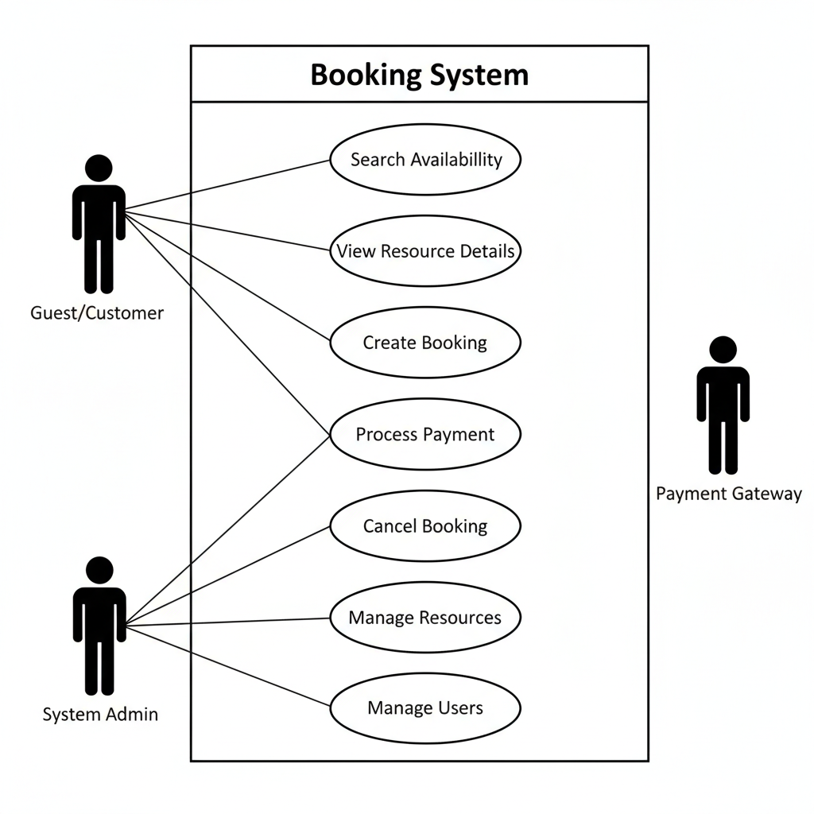

# Requirement Analysis in Software Development
This repository hosts the Requirement Analysis Project, designed to guide learners through the essential phase of software development: requirement analysis. Centered around a booking management system, the project simulates a real-world scenario where participants document, analyze, and structure requirements with clarity and precision. The goal is to build a solid blueprint that lays the groundwork for successful and efficient project execution.
## What is Requirement Analysis?
Requirement analysis is a critical process in software development lifecycle that involves gathering, evaluating, and documenting the needs and expectations of stakeholders to ensure the final product meets their requirements. This process ensures all stakeholders have a clear and mutual understanding of what the system is to do and how it is to perform.
This process involves:

- Gathering information from stakeholders and users!

- Analyzing and modeling requirements to understand system behavior
- Documenting functional and non-functional needs
- Validating that requirements are complete, feasible, and aligned with project objectives
  
### 🚀 Importance in the SDLC
Requirement Analysis is critical because it:

* Sets the direction for all subsequent development phases

- Reduces ambiguity, ensuring clear communication among developers, designers, and clients

- Minimizes rework and cost by catching issues early

- Improves quality by aligning features with user expectations and business goals

## 📌 Why is Requirement Analysis Important?
Requirement Analysis plays a key role in the success of any software project. Here’s why:
- Clarity and Understanding: It reduces ambiguity by capturing stakeholder expectations in detail.
- Scope Definition: It defines the project boundaries, helping prevent scope creep and uncontrolled changes.
- Basis for Design and Development: Provides a solid foundation for designing and developing the system.
- Cost and Time Estimation: Facilitates accurate estimation of project cost, resources, and time.
- Quality Assurance: Ensures that the final product meets the specified requirements, leading to higher customer satisfaction.

## 🔍 Key Activities in Requirement Analysis
Requirement Analysis involves a series of structured tasks that help define what a software system should do and how it should behave. For the booking management system in this project, the following five key activities are essential:

- Requirement Gathering This is the initial step where information is collected from stakeholders, users, and domain experts. It focuses on understanding the business needs and expectations for the system.

- Requirement Elicitation Elicitation involves engaging with stakeholders through interviews, surveys, workshops, and observation to uncover hidden needs, constraints, and priorities that may not be immediately obvious.

- Requirement Documentation All gathered and elicited requirements are formally recorded in structured formats such as user stories, use cases, or requirement specifications. This ensures clarity and traceability throughout the development process.

- Requirement Analysis and Modeling In this phase, requirements are examined for feasibility, consistency, and completeness. Modeling tools like diagrams (e.g., use case diagrams) are used to visualize system behavior and interactions.

- Requirement Validation The final step ensures that documented requirements accurately reflect stakeholder needs. Validation may involve reviews, walkthroughs, or prototyping to confirm that the requirements are correct and actionable.

# 📂 Types of Requirements
Software requirements are typically categorized into two main types: Functional and Non-functional. Both are essential for building a system that not only works correctly but also performs efficiently and meets user expectations.
### 🔧 Functional Requirements
Functional requirements describe the specific behaviors, features, and interactions the system must support. They define what the system should do.

Examples for the Booking Management System:
- Search Properties: Users should be able to search for properties based on various criteria such as location, price, and availability.
- User Registration: New users should be able to create an account with personal details and login credentials.
- Property Listings: Display properties with essential details and images.
- Booking System: Users should be able to book properties, view booking details, and manage their bookings.
- User Authentication: Secure login and registration process for users

### ⚙️ Non-functional Requirements
Non-functional requirements define the quality attributes of the system—how it performs rather than what it does.

Examples for the Booking Management System:

- Performance: The system should load pages within 2 seconds and handle up to 1000 concurrent users.
- Security: Ensure data encryption, secure login, and protect against common vulnerabilities.
- Scalability: The system should be able to scale horizontally to handle increased traffic.
- Usability: The application should have an intuitive UI/UX, making it easy for users to navigate and perform tasks.
- Reliability: The system should have an uptime of 99.9% and recover quickly from any failures.

  ## Use Case Diagrams

Use Case Diagrams are part of the **Unified Modeling Language (UML)** and represent the **functional requirements** of a system. They show the relationship between **actors** (users or other systems that interact with the system) and **use cases** (specific tasks or functions the system provides to the actor).

### Benefits of Use Case Diagrams

1.  **Clear Communication:** They provide an easy-to-understand view of the system's scope, allowing technical and non-technical stakeholders to agree on the required functionality.
2.  **Scope Definition:** They clearly define the **system boundary** and what the system is expected to do, which helps in managing project scope and preventing **scope creep**.
3.  **Foundation for Further Analysis:** Each use case serves as a starting point for detailed requirement elicitation, leading to more comprehensive specifications (e.g., use case descriptions, activity diagrams).
4.  **Early Planning:** They assist in early project planning, test case generation, and estimating development effort.

### Use Case Diagram for a Booking System

The diagram below illustrates the high-level functional requirements for the booking system, defining who (Actors) does what (Use Cases) within the system's boundary.

| Element | Description |
| :--- | :--- |
| **Actors** | **Customer:** The person making a booking. **System Administrator:** The person managing the system, content, and users. **Payment Gateway:** An external system handling financial transactions. |
| **Use Cases** | **Search Availability:** Customer searches for available dates/items/slots. **Make Booking:** Customer reserves an available item/slot. **Cancel Booking:** Customer or Admin cancels an existing booking. **Manage System:** Admin adds, modifies, or deletes system resources, users, or content. **View Booking Details:** Customer or Admin checks the details of a specific booking. |

### Diagram

## ✅ Acceptance Criteria
Acceptance Criteria are predefined conditions that a software feature must meet to be considered complete and acceptable by stakeholders. In the context of Requirement Analysis, they serve as a bridge between business expectations and technical implementation, ensuring clarity, alignment, and quality throughout the development process.

#### 🔍 Importance in Requirement Analysis
- Ensure all parties have a clear understanding of feature requirements.
- Provide a basis for testing and validation.
- Help in maintaining quality and meeting user expectations.
- Supports Agile Development

#### 🛒 Example: Checkout Feature in Booking Management System
Acceptance Criteria:

User must be logged in to initiate checkout.

Payment options (e.g., credit card, PayPal) must be available and functional.

Users should be able to select available dates, confirm booking, and receive a confirmation email within 2 minutes

